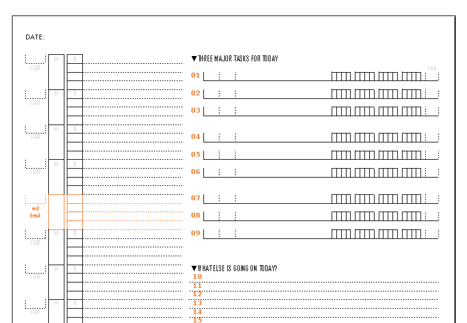

# emergent-planner
Daily task planner &amp; project tracker

* Segment days into 15-minute chunks
* Plan out 3 major activities (room for more if necessary)
* Track the time for each project by filling in the squares
* Space for 30 'notes'

Based off @daveseah [Productivity Tools](http://davidseah.com/node/the-emergent-task-planner/):

> Getting even three things done on purpose is hard enough. 

1. Start: Fill in today's date at the top of the form. Number the hours (starting at 8 if 8AM)
2. Optional: Every four hours, schedule an hour break
3. Write down 3 things. You can list up to 9 tasks (⚠ Don't strain yourself!)
4. Optional: Track/Estimate time up to 4 hours using 15min boxes
5. Decide what time to do the tasks
6. Use the Note area to jot down reminders
